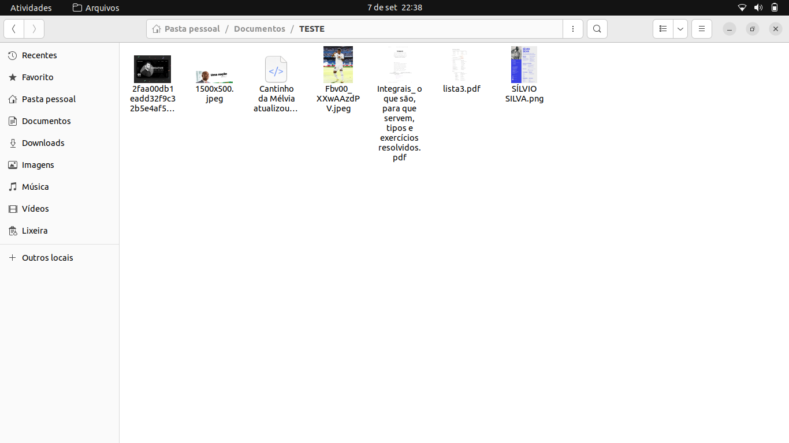
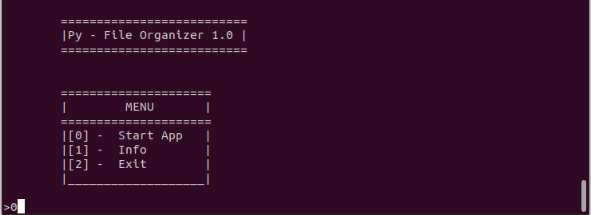
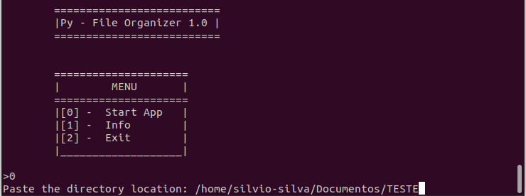
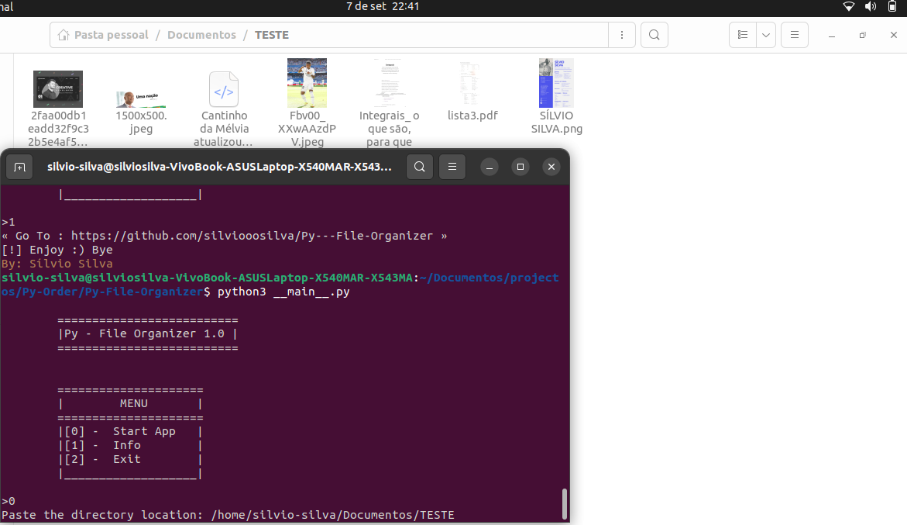
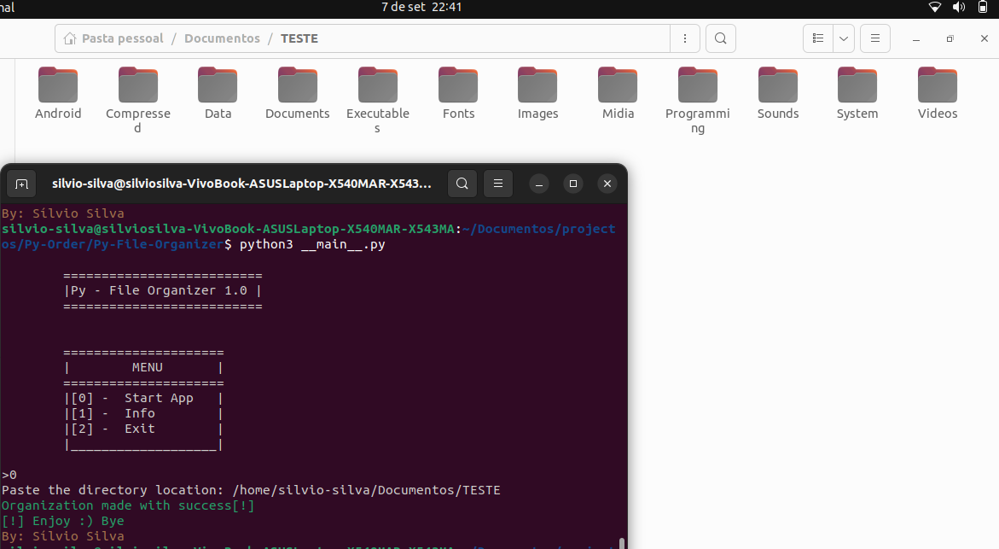

# Py - File Organizer V1.2
" Eu vou ajudar você :) :rocket:"

<div style="text-align: center">

<h1>Proposta</h1>
<p>
A principal motivação que me levou a construir esse programa, deve - se a factores organizacionais,
eu sei que você já se deparou com um diretório super bagunçado , e consequentemente , acabaste por não
achar o que procuravas... 

<br/>
É meio chato e aborrecido ter que ficar criando pastas, procurando cada arquivo e depois o mover para as respectivas pastas, 
sou um desses que não possui tanta paciência para isso 

<br />
Então , porque não automatizar esse processo todo? <br />
Pensando nisso, trago para você o <b>Py - File Organizer </b>, um programa simples, super intuitívo(pensando no usuário)
para automatizar o que levaria minutos ou até mesmo horas

</p>

<h1>Como Usar?</h1>

```
1º Clone/Faça o download -> git clone https://github.com/silviooosilva/Py---File-Organizer
2º Acesse o diretório do programa -> cd Py-File-Organizer
3º Rode o programa -> python3 __main__.py
```
<br>
<p>Após esse processo todo , basta inserir/colar a localização do diretório que deseja organizar ,
e o programa fará o resto por sí num piscar de olhos :rocket:
</p>


<div>

<h1>Dependências</h1>

<h3>Colorama</h3>

```
pip install -r requirements.txt
```
</div>


<div>

<h1>Demo</h1>

</p>Um diretório com conteúdo bem aleatório e de diferentes formatos</p>
<p>

</p>

<p>Inicialização do programa! Está é a tela principal</p>
<p>

</p>

<p>Aqui eu coloco o caminho do diretório que eu desejo. <b>Atenção:</b>É necessário que o caminho esteja bem inserido, sem erros!</p>

<p>

</p>


<p>Aqui eu mostro a tela do programa(antes de clicar para a inicialização da organização) para que se constate o diretório e o programa antes da execução!</p>

<p>

</p>

<p>Aqui está o diretório após a inicialização do programa! Constando também no programa, uma mensagem informando que a execução foi realizada com sucesso!</p>


<p>

</p>


<br>

<h3>NB: As demais pastas são geradas para poupar memória caso seja necessário rodar o programa novamente no mesmo diretório</h3>
</div>


<h1>Conclusão</h1>

<p>
Esteja avontade para contribuir na melhoria do programa :) :rocket:
</p>

</div>

<div>

<h1>Feito com 💜 Por : <b>Sílvio Silva</b></h1>

</div>
